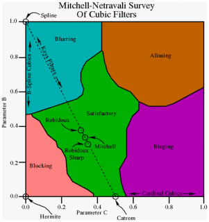

# Resampling

## Upsampling

Or supersampling, upscaling. It is important to know which
resamplers work best for upsampling and to be able to tell (to some
extent) what sort of resizing kernel was used on a source in order to
reverse bad upscales.

A very extensive and informative discussion 
of different resize methods and kernels can be found
in imagemagick’s guides:

1. [General overview of filter kernels][imagemagick guide].
2. [Overview of best resizing practices][Nicholas Robidoux guide]

A mathematical comparison of a wide range of popular scaling methods
can be found [here][mpv upscaling].

A visual comparison of different resize kernels can be found [here][kernels diff].

##### Mitchell-Netravali 

The Mitchell-Netravali filter, 
also known as **Bicubic**,
is the most common scaling algorithm
(barring, perhaps, Bilinear)
and the default for many image processing programs.
It takes two parameters, B and C,
which can be used to tweak the filter’s behaviour.
The graph below outlines 
the various kinds of artifacts
different B-C-configurations produce.

Over the years, certain names have been established 
for some parameter sets, namely:

- B-Spline – b=1, c=0
- Hermite – b=0, c=0
- Mitchell-Netravali – b=1/3, c=1/3 
(the most common parameters;
usually considered a good neutral default)
- Catmull-Rom – b=0, c=0.5
- Sharp Bicubic – b=0, c=1

[imagemagick guide]: http://www.imagemagick.org/Usage/filter/
[Nicholas Robidoux guide]: http://www.imagemagick.org/Usage/filter/nicolas/
[mpv upscaling]: https://artoriuz.github.io/mpv_upscaling.html
[kernels diff]: https://diff.pics/AOJ4sBhbe6SX/1

##  Downsampling

TODO

##  Chroma Subsampling

TODO
